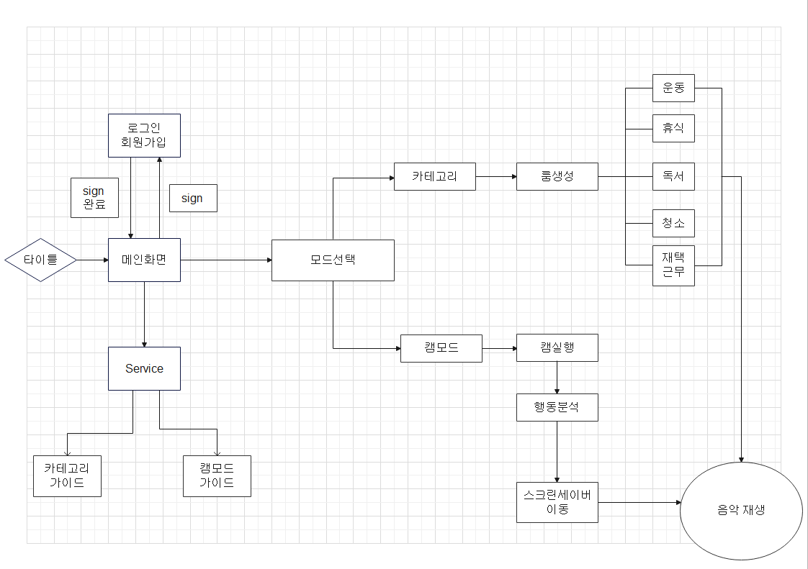
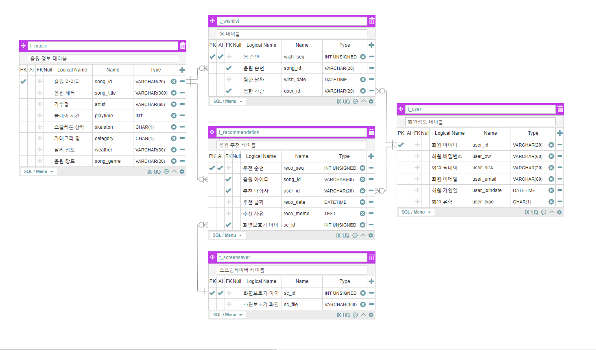
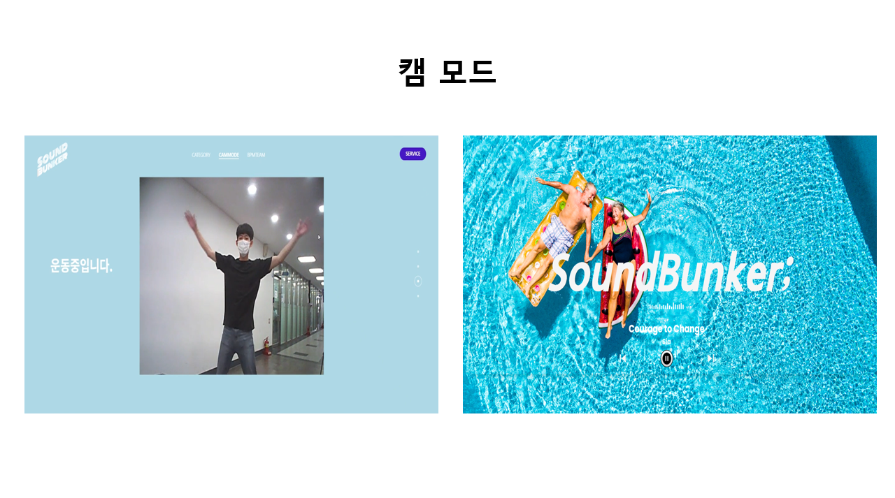
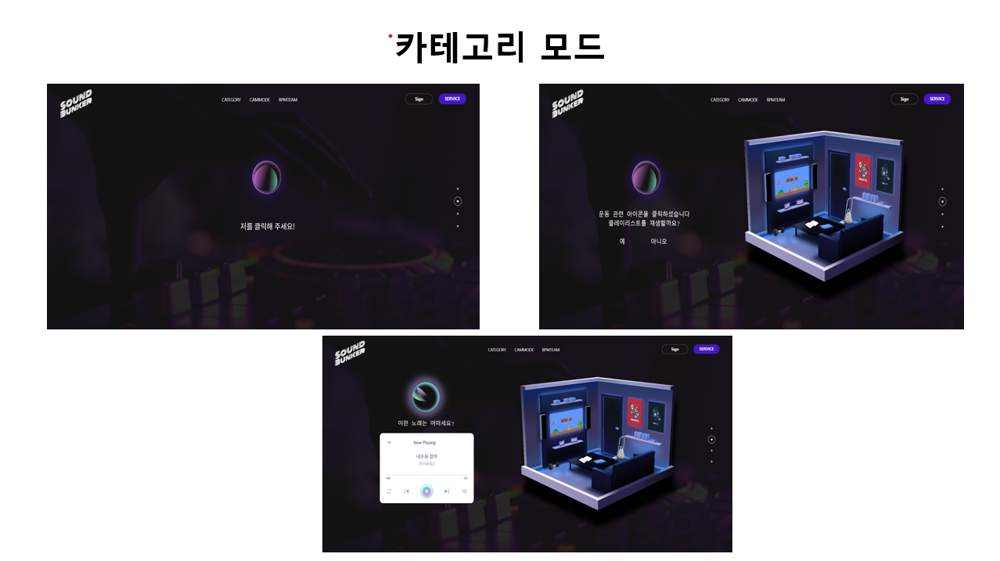
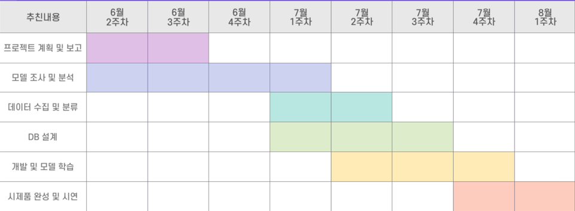

# SoundBunker(팀명: BPM )

## 1. 프로젝트명
* 움직임과 사물 감지를 통한 상황 맞춤 음악 스트리밍 서비스
* 서비스설명: 미디어파이프의 포즈랜드마크 모델을 통해 움직임을 분석하고 YOLOv5로 객체를 탐지하여 종합된 결과로 상황을 분석하여, 이에 맞는 음악을 통해 사용자의 홈라이프를 보조해주는 서비스입니다.

## 2. 주요기능
* 미디어파이프의 포즈랜드마크 모델을 통한 사용자 움직임 분석
* YOLOv5모델을 학습시켜 객체 탐지
* 카테고리모드의 아이콘을 통해 특정 카테고리에 맞는 음악 재생
* 노래분류용 DNN모델을 사용해 장르 및 분위기, 빠르기 등 세분화를 통한 음악 분류
* 스크린세이버

## 3. 개발환경
|구분|내용|
|------|---|
|사용언어|Java, HTML, CSS, JavaScript, Python|
|사용한 라이브러리| Bootstrap / Kakao Map /  jQuery / MyBatis etc...|
|개발도구|Spring Framework /  VisualStudioCode  / Jupyter etc...|
|서버환경|tomcat 9.0 , Flask |
|데이터베이스| MySQL / etc..|

## 4. 아키텍처(구조)

## 5. 기능 흐름도
### 서비스 흐름도(유스케이스)
#### SW 유스케이스

#### 서비스 흐름도(웹 화면설계서)

#### ER 다이어그램

## 6 SW 동작 화면

### 메인페이지

### 캠모드

### 카테고리모드

## 7 제작 일정

## 8 팀원 단위 업무 분장 및 결과표

## 9 트러블슈팅

* 문제1 

 
* 문제2 

