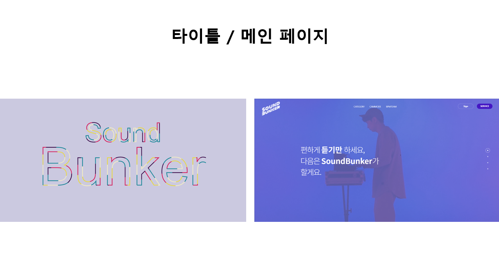

# SoundBunker(팀명: BPM )

## 1. 프로젝트명
* 움직임과 사물 감지를 통한 상황 맞춤 음악 스트리밍 서비스
* 서비스설명: 

## 2. 주요기능
* 
* 
* 
* 
* 

## 3. 개발환경
|구분|내용|
|------|---|
|사용언어|Java, HTML, CSS, JavaScript, Python|
|사용한 라이브러리| Bootstrap / Kakao Map /  jQuery / MyBatis etc...|
|개발도구|Spring Framework /  VisualStudioCode  / Jupyter etc...|
|서버환경|tomcat 9.0 , Flask |
|데이터베이스| MySQL / etc..|

## 4. 아키텍처(구조)

## 5. 기능 흐름도
### 서비스 흐름도(유스케이스)
#### SW 유스케이스

#### 서비스 흐름도(웹 화면설계서)

#### ER 다이어그램

## 6 SW 동작 화면

### 메인페이지

### 캠모드

### 카테고리모드

## 7 제작 일정

## 8 팀원 단위 업무 분장 및 결과표

## 9 트러블슈팅

* 문제1 

 
* 문제2 

